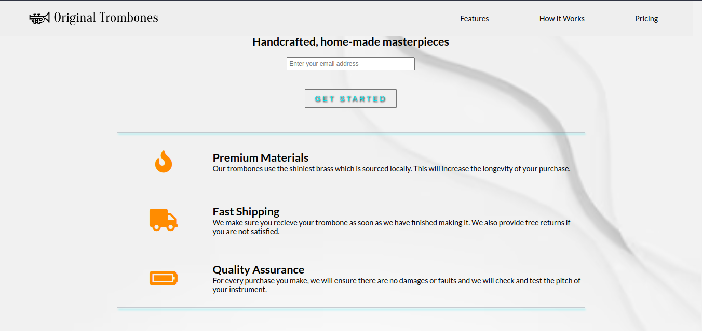
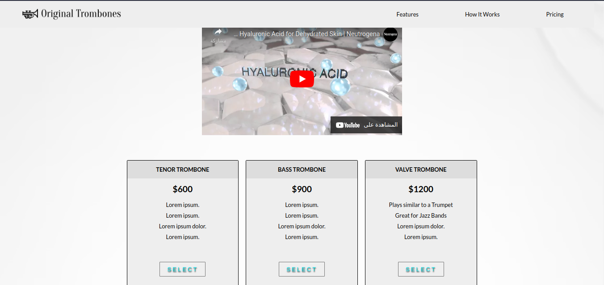

# Product Landing Page
 
# Product Landing Page

This is a responsive product landing page that meets the following user stories:

- As a user, I can view a product landing page with a header section that contains a logo, a navigation menu, and an embedded product video.
- As a user, I can navigate to different sections of the landing page by clicking the corresponding links in the navigation menu.
- As a user, I can enter my email address in a form input field and submit it to receive more information about the product.
- As a user, I can view the landing page on different devices and screen sizes, with the layout and content adapting accordingly.
- As a developer, I can see how HTML, CSS, and JavaScript can be used to build a modern and visually appealing web page, featuring flexbox and media queries.

The landing page includes the following features:

- A header section with a logo image and a responsive navigation menu.
- A video section showcasing the product with an embedded YouTube video.
- A form section with a responsive input field for entering an email address, along with HTML5 validation and a submit button that sends the data to a static page.
- A footer section with social media links and copyright information.
- CSS flexbox and media queries to create a responsive and modern layout that adapts to different screen sizes and devices.

To view the landing page, download the repository and open the `index.html` file in your web browser.

## Technologies Used

- HTML
- CSS
- JavaScript
- Flexbox
- Media Queries
 
To see a live preview of the Product Landing Page, visit #[this link](https://estrella-cutiepie.me/Build-a-Product-Landing-Page/).
## Credits

This project was completed as part of the freeCodeCamp Responsive Web Design Certification. The product video used in the landing page is a Creative Commons video from Neutrogena®.
